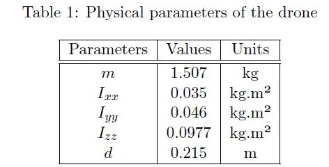

# Autonomous Landing of a Quadrotor on a Moving Vehicle

The task consists of the autonomous landing of a multirotor micro aerial vehicle (MAV)on a moving
ground vehicle (GV). Our focus in this work is to develop an algorithm enabling a feasible and
smooth landing. The drone has first to reach the waiting point and hovers at the height of 5 m
above the road. As soon as the car passes, the MAV starts the landing manoeuvre.

   Figure 1: Forces, moments and frames. Modified from [2]. 
  

## Prerequisites
The simulation are performed using Simulink. We used also the Model Predictive Control Toolbox from Mathworks and the MATLAB Driving Scenario Designer application
## Getting Started
To run the simulation, open "initMain.m"  
## Simulation Setup
The drone parameters are given by [2] and presented in table 1.

### Scenarios
We test the model for different driving scenarios. We define a successful landing as when the drone reaches a distance of 0.7 m from the centre of mass of the GV.
Under "Scenarios" you will find the following driving scenarios: 
  #### Scenario 1
The GV is on Road 1 (straight). It starts with a velocity v = 0m/s. At x = 50m the target has to
reach v = 5m/s.
  #### Scenario 2
The GV is on Road 1 (straight). It starts with a velocity v = 0m/s. At x = 50m the target has to
reach v = 7m/s.
  #### Scenario 3
The GV is on Road 2 (curved). It starts with a velocity v = 0m/s. At x = 10m the target has to
reach v = 5m/s and then maintain a constant speed until reaching the end of the road.
  #### Scenario 4
The GV is on Road 2 (curved). It starts with a velocity v = 0m/s. At about x = 10m the target
has to reach v = 5m/s and then accelerating until reaching v = 7m/s at x = 40m.

### Controller 
Under "Test_Controller" you can test the LQR controller. We provide an open-loop system "Model.xls" and a closed-loop system "ModelCl.xls". Ran the file "testCtr.m" to get the step response. 

### Guidance
Under "Test_Guidance" we provide a separate guidance system, so you can test the landing trajectories by running the Simulink model "guidance.xls"

## Bibliography
[1] Borowczyk A. et al. “Autonomous landing of a quadcopter on a high-speed ground vehicle”.
In: Journal of Guidance, Control, and Dynamics 40.9 (2017), pp. 2378–2385. 

[2] Mathieu Ulysse Ashby.“Pilotage autonome agressif de drone dans un environnement de course”.
MA thesis. ´ Ecole Polytechnique de Montr´eal, 2020.

[3] MathWorks. MPC. [Online; accessed 05-05-2022]. 2022. url: https://de.mathworks.com/
help/mpc/gs/introduction.html.

[4] Duc-Tien Nguyen, David Saussie, and Lahcen Saydy. “Design and Experimental Validation of
Robust Self-Scheduled Fault-Tolerant Control Laws for a Multicopter UAV”. In: IEEE/ASME
Transactions on Mechatronics 26.5 (2021), pp. 2548–2557. doi: 10 . 1109 / TMECH . 2020 .
3042333.

[5] David Saussi´e. AER8410 Lecture Notes. ´ Ecole Polytechnique de Montr´eal. 2021.

[6] Baca Tom´aˇs et al.“Autonomous landing on a moving vehicle with an unmanned aerial vehicle”.
In: Journal of Field Robotics (2019).
